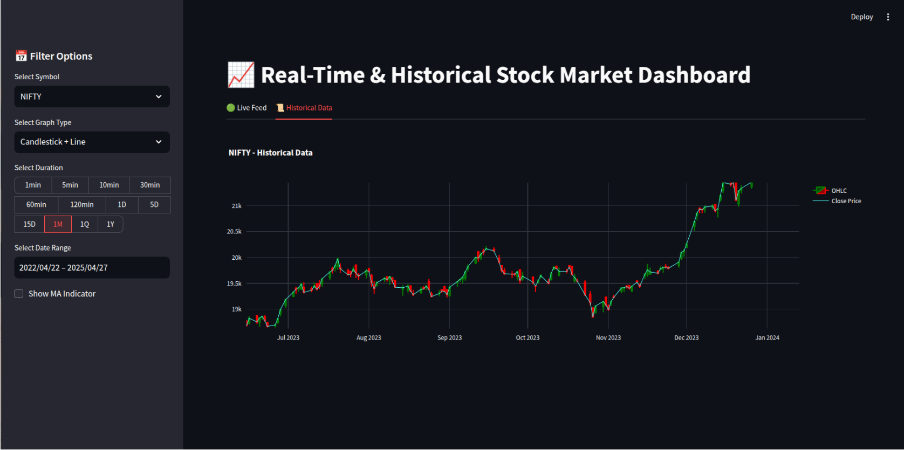

# Real-Time Stock Market Data Warehousing & Prediction System

## Overview

The stock market generates vast amounts of high-velocity data, demanding efficient processing and analysis for timely decision-making. This project implements a robust data warehousing solution designed to handle dynamic, real-time stock market data streams.

## Architecture

### Data Ingestion

- **Source:** Real-time stock market data is acquired via socket streaming.
- **Buffering:** Incoming data is initially buffered in a high-speed **Redis** server, ensuring resilience against ingestion bursts and temporary slowdowns downstream.

### Data Transformation

- **Aggregation:** Tick or second-level data is transformed into standardised OHLC (Open, High, Low, Close) intervals (e.g., one minute).
- **Standardization:** Data is cleaned, validated, and consistently formatted for downstream storage.

### Data Persistence

- **Warehouse:** Structured OHLC data is persistently stored in a **PostgreSQL** database, serving as the central data warehouse for analytical workloads.

### Predictive Analytics

- **Model:** An **ARIMA (Autoregressive Integrated Moving Average)** model utilizes historical OHLC data stored in PostgreSQL to predict the next minute's OHLC values.
- **Insight Generation:** The system overlays predictions atop historical data, generating buy/sell indicators based on forecasted trends.

### Visualization

- **Dashboard:** A real-time, interactive dashboard built with **Streamlit** visualizes candlestick charts for selected instruments (e.g., NIFTY50, USDINR).
- **Features:**
  - Live-updating candlestick charts.
  - Overlay of predicted OHLC values.
  - Display of buy/sell signals derived from prediction logic.
  - Instrument selector for on-demand analysis.

## System Components

- **Data Streaming:** Socket-based ingestion
- **Ingestion Buffer:** Redis
- **Data Warehouse:** PostgreSQL
- **Data Transformation:** Aggregation and cleaning pipeline
- **Predictive Model:** ARIMA, trained on historical OHLC data
- **Dashboard:** Streamlit web app

## Benefits

- **High Throughput:** Efficient buffering and ingestion for rapid data streams.
- **Data Integrity:** Reliable, consistent warehousing of structured financial data.
- **Predictive Power:** Time series modeling for short-term forecasting.
- **Actionable Visuals:** Real-time insight delivery via an interactive dashboard.

## Getting Started

1. **Clone the Repository**

2. **Install Dependencies**
pip install -r requirements.txt

3. **Configure Environment**
- Setup Redis and PostgreSQL instances.
- Adjust configuration files as needed.

4. **Start the Pipeline**
   - start generating data nifty_server.py and serverr_2.py in separate terminal.
   - Start primary_client.py to get the generated data.
   - finally start main.py using command streamlit run main.py

